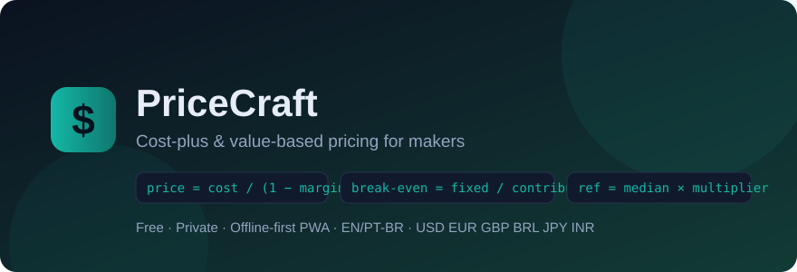

<div align="center">



# 💲 PriceCraft

**Cost-plus & value-based pricing calculator for makers — free, private, offline-first.**
**Calculadora de preço custo+margem e valor percebido para artesãos e makers — grátis, privada, offline.**

[](https://github.com/chr-z/pricecraft/actions/workflows/ci.yml)
[](https://github.com/chr-z/pricecraft/actions/workflows/pages.yml)
[](LICENSE)
[](#internationalization--internacionaliza%C3%A7%C3%A3o)
[](package.json)
[](manifest.json)

🔗 **Live demo → [chr-z.github.io/pricecraft](https://chr-z.github.io/pricecraft/)** · no signup, works offline after first load

</div>

---

Underpricing is the #1 mistake makers make. PriceCraft fixes that in under a minute: enter your
materials and hours once, get a **defensible price** backed by two proven methods —
**cost-plus** (your costs + a healthy margin) and **value-based** (anchored on the market median,
scaled by how much extra worth customers perceive). A built-in **break-even** panel tells you
exactly how many units pay the bills.

Everything runs in your browser. No account, no server, no telemetry — your pricing strategy is
nobody's business but yours.

> 🇧🇷 Sabe aquele preço "no feeling" que depois dá prejuízo? O PriceCraft calcula custo real,
> margem saudável, compara com o mercado e mostra o ponto de equilíbrio. Interface em português
> ou inglês, moeda em R$, US$, €, £, ¥ ou ₹.

## ✨ Features

| | |
|---|---|
| 🧮 **Cost-plus engine** | Materials + labor + overhead → total cost; margin applied correctly as `price = cost / (1 − margin)`, not the classic ×1.5 guess |
| 📊 **Value-based analyzer** | Enter competitor prices, get median/range and a reference price scaled by your differentiation multiplier |
| ⚖️ **Break-even panel** | Fixed costs, unit economics → exact units to sell before profit starts |
| 🪄 **Charm endings** | One click converts `144.00` into `143.99`-style retail prices |
| 💱 **Six currencies** | USD, EUR, GBP, BRL, JPY, INR with proper locale formatting (`R$ 1.234,50` vs `$1,234.50`) via `Intl` |
| 🌎 **EN / PT-BR interface** | Header switcher, persisted choice, plain JSON dictionaries — add a language by adding one file |
| 💾 **Scenario library** | Save every calculation, export/import everything as JSON, delete what's stale |
| 📲 **Installable PWA** | Manifest + service worker with stale-while-revalidate caching: opens offline, installs on phone/desktop |
| 🛡️ **Private by design** | Zero runtime dependencies, zero network calls, zero cookies, zero telemetry |
| ♿ **Accessible** | Keyboard-navigable tabs with ARIA roles, focus-visible rings, reduced-motion support |

## 🧠 How the math works (the senior-engineer part)

Most pricing calculators do `cost × 1.5` and call it a day — that confuses **margin** with
**markup**. PriceCraft gets it right:

```
productionCost = materials + hours × hourlyRate
totalCost      = productionCost × (1 + overhead%)
suggestedPrice = totalCost / (1 − margin%)        ← margin on PRICE, not on cost
profit         = suggestedPrice − totalCost
breakEvenUnits = ceil(fixedCosts / (price − variableCost))
referencePrice = median(competitorAnchors) × differentiationMultiplier
```

Every formula is covered by **19 unit tests** running on Node's built-in test runner in CI.

## 🚀 Quick start

1. Open the [live demo](https://chr-z.github.io/pricecraft/)
2. Pick your currency & language in the header
3. **Cost-plus**: enter materials, hours, hourly rate, overhead % and target margin → get your price
4. Cross-check against competitors in the **Value-based** tab
5. Hit **Save scenario**, compare later, export JSON whenever you want

## 🖼️ Screenshots

> Coming soon — meanwhile the [demo](https://chr-z.github.io/pricecraft/) loads in under 2 seconds,
> even on a phone.

## 💰 Pricing

| | Free | |
|---|---|---|
| Cost-plus calculator | ✅ unlimited | |
| Value-based analyzer | ✅ unlimited | |
| Break-even panel | ✅ unlimited | |
| Saved scenarios + JSON export | ✅ unlimited | |
| Currencies & languages | ✅ all 6 / both | |
| Ads, accounts, tracking | ❌ never | **$0 forever** |

A Pro tier (PDF price sheets, multi-product catalogs) may arrive post-v2 — see roadmap.

## 🗺️ Roadmap

- [x] v1 — cost-plus, value-based, break-even, charm endings, i18n, PWA
- [ ] PDF price sheet export
- [ ] Multi-product catalog with per-product margins
- [ ] Margin ↔ markup converter widget
- [ ] More locales (ES, DE) — community welcome

## 🧑‍💻 For developers

```bash
git clone https://github.com/chr-z/pricecraft && cd pricecraft
node --test tests/*.test.js     # run the business-logic suite (zero deps)
python -m http.server 8080      # or any static server → http://localhost:8080
```

Project layout:

```
js/core.js    pure pricing functions (fully tested, DOM-free)
js/app.js     UI wiring only
js/i18n.js    dictionary loader + header switcher
locales/      en.json, pt-BR.json — add a language by adding a file
tests/        node:test suite over core.js
```

## Internationalization / Internacionalização

Interface available in **English** and **Português (BR)**. The switcher lives in the header;
the choice persists in `localStorage`. Dictionaries are plain JSON under [`locales/`](locales/).

## License

[MIT](LICENSE) © Built by [@chr-z](https://github.com/chr-z)
